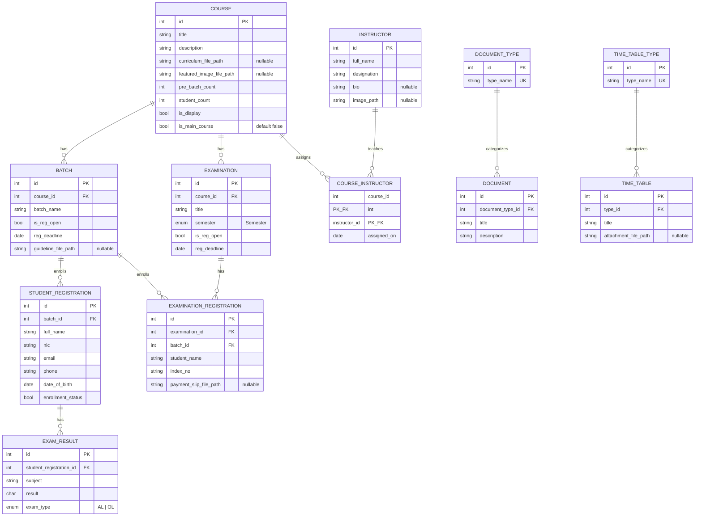

# Crestview Institute — Entity Relations

Entity-relationship design for a Web API practice project modeling a training institute's course, batch, and examination management system. Scoped for a focused two-week build in ASP.NET Core with EF Core.

## What this design supports

| Concept | Where it shows up |
|---|---|
| **Inheritance / abstraction** | Every entity inherits `Id`, `CreatedAt`, `UpdatedAt` from an abstract `BaseEntity`. |
| **One-to-many** | `Course → Batch`, `Course → Examination`, `Batch → StudentRegistration`, `Batch → ExaminationRegistration`, `StudentRegistration → ExamResult`, `Examination → ExaminationRegistration`, `DocumentType → Document`, `TimeTableType → TimeTable`. |
| **Many-to-many (with payload)** | `Course ↔ Instructor` via an explicit `CourseInstructor` join entity carrying `AssignedOn` — practices Fluent API composite keys and join entity configuration. |
| **Enums** | `UserRole`, `Semester`, `ExamType` — EF Core enum-to-column conversion. |
| **Lookup/category pattern** | `DocumentType`/`TimeTableType` as simple reference tables — a distinct 1:N shape from the "aggregate owns children" relations above. |
| **Nullable vs required fields** | A deliberate mix gives real cases for nullable reference types and validation attributes. |
| **Domain grouping** | Entities are grouped by responsibility — a natural seam for feature folders, per-domain services/repositories, and SOLID's Single Responsibility Principle. |

---

## Base Entity

All entities below inherit these three fields (not repeated in each table):

| Field | Type | Notes |
|---|---|---|
| `Id` | int (PK) | auto-increment |
| `CreatedAt` | DateTime | set on insert |
| `UpdatedAt` | DateTime | set on insert and update |

```csharp
public abstract class BaseEntity
{
    public int Id { get; set; }
    public DateTime CreatedAt { get; set; }
    public DateTime UpdatedAt { get; set; }
}
```

---

## Overview Diagram



**Standalone entity** (no relations): `User` — used for authentication/authorization only.

---

## Domain Grouping

| Domain | Entities | Suggested feature folder |
|---|---|---|
| Identity & Auth | User | `Identity` |
| Courses & Instructors | Course, Instructor, CourseInstructor | `Courses` |
| Batches & Enrollment | Batch, StudentRegistration, ExamResult | `Enrollment` |
| Examinations | Examination, ExaminationRegistration | `Examinations` |
| Documents | Document, DocumentType | `Documents` |
| Timetables | TimeTable, TimeTableType | `Timetables` |

Each domain is a reasonable boundary for its own controller, service interface, and repository — a natural place to practice constructor injection and interface-based design (`ICourseService`, `IStudentRegistrationRepository`, etc.) rather than one giant service.

---

## Entity Reference

`UK` = unique key. Unmarked columns are required (`NOT NULL`). All entities also carry `Id`, `CreatedAt`, `UpdatedAt` from `BaseEntity` (not repeated below).

### User
Custom user table for authentication; no Identity framework.

| Field | Type | Required | Default |
|---|---|---|---|
| `FullName` | string(255) | Yes | — |
| `Email` | string(50), **unique** | Yes | — |
| `PasswordHash` | string(100) | Yes | — |
| `Role` | enum `UserRole` | Yes | — |
| `IsDeleted` | bool | Yes | `false` |

---

### Course
Top-level academic course offering.

| Field | Type | Required | Default |
|---|---|---|---|
| `Title` | string(100) | Yes | — |
| `Description` | string | Yes | — |
| `CurriculumFilePath` | string(255) | No | — |
| `FeaturedImageFilePath` | string(255) | No | — |
| `PreBatchCount` | int | Yes | — |
| `StudentCount` | int | Yes | — |
| `IsDisplay` | bool | Yes | — |
| `IsMainCourse` | bool | Yes | `false` |

**Relations**
- `Batches: ICollection<Batch>` — one Course has many Batch
- `Examinations: ICollection<Examination>` — one Course has many Examination
- `CourseInstructors: ICollection<CourseInstructor>` — many-to-many to Instructor via join entity

---

### Instructor
A teaching staff member who can be assigned to multiple courses.

| Field | Type | Required | Default |
|---|---|---|---|
| `FullName` | string(100) | Yes | — |
| `Designation` | string(50) | Yes | — |
| `Bio` | string | No | — |
| `ImagePath` | string(255) | No | — |

**Relations**
- `CourseInstructors: ICollection<CourseInstructor>` — many-to-many to Course via join entity

---

### CourseInstructor
Explicit join entity for the Course ↔ Instructor many-to-many relation. Composite primary key `(CourseId, InstructorId)`.

| Field | Type | Required | Default |
|---|---|---|---|
| `CourseId` (PK, FK → Course) | int | Yes | — |
| `InstructorId` (PK, FK → Instructor) | int | Yes | — |
| `AssignedOn` | date | Yes | today |

> Note: this entity does **not** inherit `BaseEntity` — pure join entities typically don't need their own `Id`/timestamps beyond the composite key and payload field.

**Relations**
- `Course: Course` — many CourseInstructor rows belong to one Course
- `Instructor: Instructor` — many CourseInstructor rows belong to one Instructor

---

### Batch
An intake/cohort of a Course, open for registration within a deadline.

| Field | Type | Required | Default |
|---|---|---|---|
| `BatchName` | string(100) | Yes | — |
| `IsRegOpen` | bool | Yes | — |
| `RegDeadline` | DateOnly | Yes | — |
| `GuidelineFilePath` | string(255) | No | — |
| `CourseId` (FK → Course) | int | Yes | — |

**Relations**
- `Course: Course` — many Batch belong to one Course
- `StudentRegistrations: ICollection<StudentRegistration>` — one Batch has many StudentRegistration
- `ExaminationRegistrations: ICollection<ExaminationRegistration>` — one Batch has many ExaminationRegistration

---

### StudentRegistration
A student's enrollment record for a Batch, trimmed to the essential mandatory fields.

| Field | Type | Required | Default |
|---|---|---|---|
| `FullName` | string(255) | Yes | — |
| `Nic` | string(12) | Yes | — |
| `Email` | string(50) | Yes | — |
| `Phone` | string(12) | Yes | — |
| `DateOfBirth` | DateOnly | Yes | — |
| `EnrollmentStatus` | bool | Yes | — |
| `BatchId` (FK → Batch) | int | Yes | — |

**Relations**
- `Batch: Batch` — many StudentRegistration belong to one Batch
- `Results: ICollection<ExamResult>` — one StudentRegistration has many ExamResult

---

### ExamResult
Individual subject results tied to a student registration.

| Field | Type | Required | Default |
|---|---|---|---|
| `Subject` | string(100) | Yes | — |
| `Result` | char | Yes | — |
| `ExamType` | enum `ExamType` (`AL`, `OL`) | Yes | — |
| `StudentRegistrationId` (FK → StudentRegistration) | int | Yes | — |

**Relations**
- `StudentRegistration: StudentRegistration` — many ExamResult belong to one StudentRegistration

---

### Examination
An examination sitting offered for a Course.

| Field | Type | Required | Default |
|---|---|---|---|
| `Title` | string(100) | Yes | — |
| `RegDeadline` | DateOnly | Yes | — |
| `IsRegOpen` | bool | Yes | — |
| `Semester` | enum `Semester` | Yes | — |
| `CourseId` (FK → Course) | int | Yes | — |

**Relations**
- `Course: Course` — many Examination belong to one Course
- `ExaminationRegistrations: ICollection<ExaminationRegistration>` — one Examination has many ExaminationRegistration

---

### ExaminationRegistration
A student's application to sit an Examination, for a specific Batch.

| Field | Type | Required | Default |
|---|---|---|---|
| `StudentName` | string(100) | Yes | — |
| `IndexNo` | string(25) | Yes | — |
| `Telephone` | string(12) | Yes | — |
| `Email` | string(45) | Yes | — |
| `Nic` | string(20) | Yes | — |
| `PaymentSlipFilePath` | string(255) | No | — |
| `ExaminationId` (FK → Examination) | int | Yes | — |
| `BatchId` (FK → Batch) | int | Yes | — |

**Relations**
- `Examination: Examination` — many ExaminationRegistration belong to one Examination
- `Batch: Batch` — many ExaminationRegistration belong to one Batch

---

### DocumentType
Category for a Document (e.g. policy, form).

| Field | Type | Required | Default |
|---|---|---|---|
| `TypeName` | string(45), **unique** | Yes | — |

**Relations**
- `Documents: ICollection<Document>` — one DocumentType has many Document

---

### Document
Downloadable document resource.

| Field | Type | Required | Default |
|---|---|---|---|
| `Title` | string(100) | Yes | — |
| `Description` | string | Yes | — |
| `DocumentFilePath` | string(255) | Yes | — |
| `DocumentTypeId` (FK → DocumentType) | int | Yes | — |

**Relations**
- `DocumentType: DocumentType` — many Document belong to one DocumentType

---

### TimeTableType
Category for a TimeTable (e.g. exam, class).

| Field | Type | Required | Default |
|---|---|---|---|
| `TypeName` | string(45), **unique** | Yes | — |

**Relations**
- `TimeTables: ICollection<TimeTable>` — one TimeTableType has many TimeTable

---

### TimeTable
A published timetable/schedule document.

| Field | Type | Required | Default |
|---|---|---|---|
| `Title` | string(100) | Yes | — |
| `Description` | string | Yes | — |
| `AttachmentFilePath` | string(255) | No | — |
| `TypeId` (FK → TimeTableType) | int | Yes | — |

**Relations**
- `Type: TimeTableType` — many TimeTable belong to one TimeTableType

---

## Enums

```csharp
public enum UserRole { Admin, Staff, Coordinator }

public enum Semester { Semester1, Semester2, Semester3, Semester4 }

public enum ExamType { AL, OL }
```

---

## Notes for the ASP.NET Core build

- **Aggregate boundaries**: `Course` is the natural aggregate root for `Batch`, `Examination`, and the `CourseInstructor` join — a good candidate for a repository that loads a course with its batches/exams via `Include()`, practicing eager vs. lazy loading trade-offs.
- **Composite key**: `CourseInstructor` needs `modelBuilder.Entity<CourseInstructor>().HasKey(ci => new { ci.CourseId, ci.InstructorId })` in `OnModelCreating` — this is the one relation in the schema that can't be configured by convention alone, so it forces you to actually write Fluent API instead of relying on EF Core's defaults everywhere.
- **Cascade behavior**: child records (`Batch`, `Examination`, `StudentRegistration`, `ExamResult`, `ExaminationRegistration`, `Document`, `TimeTable`) should cascade-delete with their parent; `CourseInstructor` should cascade-delete from either side (deleting a Course or an Instructor removes the assignment row, not the other entity).
- **Nullable reference types**: with `<Nullable>enable</Nullable>`, the "Required: No" fields above map cleanly to `string?` properties — a good forcing function to actually use C#'s nullable reference type system rather than ignoring the warnings.
